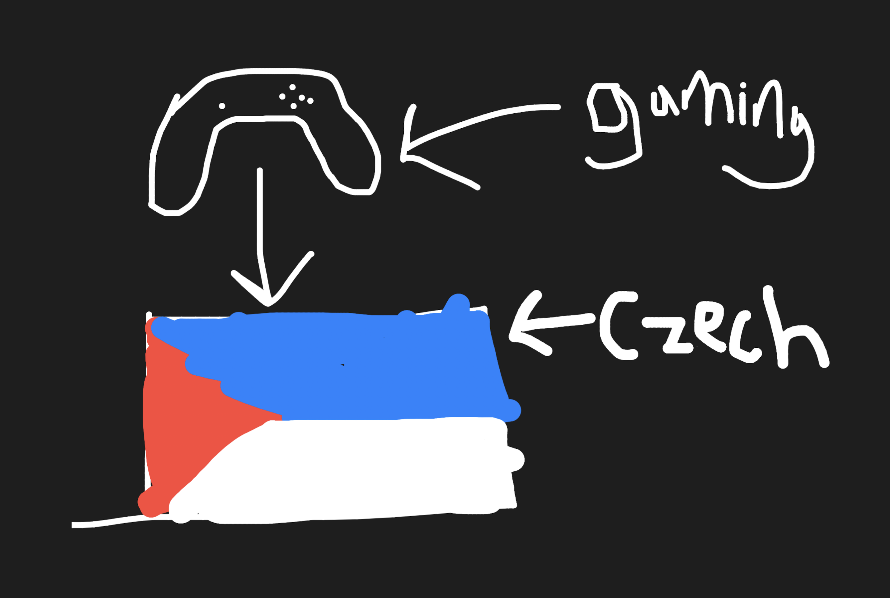

# Welcome to my Student Blog
 

This image represents me. The controller obviously represents that I game, and I won't lie, I game an unhealthy amount. It's not as bad anymore, but I used to game for like 15 hours a day. Now it's more around like 6-8. The Czech flag represents both me and my mom, because she used to live there for her entire childhood and a bit of her adulthood. She moved to America and met my dad, they married, had me 3 years later. It became a thing that every summer we went over to Czech to visit her family, and I slowely acquired a bit of the language, which I still speak now. It's very broken, but I can have basic conversations with my family. 